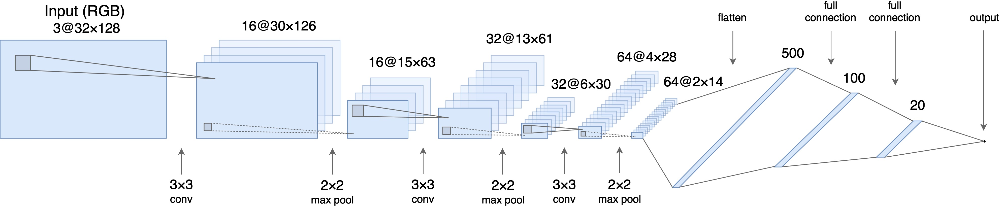
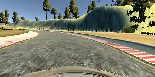
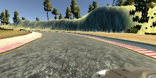
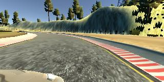

# Behavioral Cloning - Writeup

## Goals

The goals/steps of this project are the following:

- Use the simulator to collect data of good driving behavior.
- Build, a convolution neural network in [Keras](https://keras.io/) that predicts steering angles from images.
- Train and validate the model with a training and validation set.
- Test that the model successfully drives around track one without leaving the road.
- Summarize the results with a written report.

## Rubric points

Here I will consider the [rubric points](https://review.udacity.com/#!/rubrics/432/view) individually and describe how I addressed each point in my implementation.

### Files Submitted & Code Quality

#### Submission includes all required files and can be used to run the simulator in autonomous mode
My project includes the following files:

- **model.py** : Contains the script where I train the model
- **model_new.h5** : Containing a trained neural network (on track1)
- **writeup_report.md** : Project Submition Writeup
- **track1.mp4** : a video recording of the network driving autonomous on track 1.

### Resubmit Notes
1. I added two dropout layers to avoid overfitting
2. I cropped the images first before normalization to avoid unnecessary computation

## Model Architecture Design

The design of the network is based on [the NVIDIA model](https://devblogs.nvidia.com/parallelforall/deep-learning-self-driving-cars/), which has been used by NVIDIA for the end-to-end self driving test.  As such, it is well suited for the project.  

It is a deep convolution network which works well with supervised image classification / regression problems.  As the NVIDIA model is well documented, I was able to focus how to adjust the training images to produce the best result with some adjustments to the model to avoid overfitting and adding non-linearity to improve the prediction.

I've added the following adjustments to the model.

- I used Lambda layer to normalized input images to avoid saturation and make gradients work better.
- I've added two dropout layers to avoid overfitting after the convolution Flatten.
- I've also included ELU for activation function for every layer except for the output layer to introduce non-linearity.

In the end, the model looks like as follows:

- Image normalization
- Convolution: 5x5, strides: 2x2, activation: ELU
- Convolution: 5x5, strides: 2x2, activation: ELU
- Convolution: 5x5, strides: 2x2, activation: ELU
- Convolution: 3x3, activation: ELU
- Convolution: 3x3, activation: ELU
- Flatten
- Drop out (0.5)
- Drop out (0.5)
- Fully connected: neurons: 100, activation: ELU
- Fully connected: neurons:  50, activation: ELU
- Fully connected: neurons:  10, activation: ELU
- Fully connected: neurons:   1 (output)

As per the NVIDIA model, the convolution layers are meant to handle feature engineering and the fully connected layer for predicting the steering angle.  However, as stated in the NVIDIA document, it is not clear where to draw such a clear distinction.  Overall, the model is very functional to clone the given steering behavior.

The below is an model structure output from the Keras which gives more details on the shapes and the number of parameters.

| Layer (type)                   |Output Shape      |Params  |Connected to     |
|--------------------------------|------------------|-------:|-----------------|
|convolution2d_1 (Convolution2D) |(None, 31, 98, 24)|1824    |convolution2d_1         |
|convolution2d_2 (Convolution2D) |(None, 14, 47, 36)|21636   |convolution2d_2  |
|convolution2d_3 (Convolution2D) |(None, 5, 22, 48) |43248   |convolution2d_3  |
|convolution2d_4 (Convolution2D) |(None, 3, 20, 64) |27712   |convolution2d_4  |
|convolution2d_5 (Convolution2D) |(None, 1, 18, 64) |36928   |convolution2d_5  |
|flatten_1 (Flatten)             |(None, 1152)      |0       |flatten_1        |
|dropout_1 (Dropout)             |(None, 1, 18, 64) |0       |dropout_1  |
|dropout_2 (Dropout)             |(None, 1, 18, 64) |0       |dropout_2  |
|dense_1 (Dense)                 |(None, 100)       |115300  |dense_1        |
|dense_2 (Dense)                 |(None, 50)        |5050    |dense_2          |
|dense_3 (Dense)                 |(None, 10)        |510     |dense_3          |
|dense_4 (Dense)                 |(None, 1)         |11      |dense_4          |
|                                |**Total params**  |252219  |                 |

## Model Training

#### 1. Image Sizing

- the images are cropped so that the model won’t be trained with the sky and the car front parts
- the images are resized to 66x200 (3 YUV channels) as per NVIDIA model
- the images are normalized (image data divided by 255 and subtracted 0.5).  As stated in the Model Architecture section, this is to avoid saturation and make gradients work better)

#### 2. Image Augumentation

For training, I used the following augumentation technique along with Python generator to generate unlimited number of images:

- Randomly choose right, left or center images.
- For left image, steering angle is adjusted by +0.2
- For right image, steering angle is adjusted by -0.2
- Randomly flip image left or right

Using the left/right images is useful to train the recovery driving scenario.  The horizontal translation is useful for difficult curve handling (i.e. the one after the bridge). The left and right images helps us to generalize the network.

#### 3. Examples of Images

**Center Image**

**Left Image**

**Right Image**

## Training, Validation and Test

I splitted the images into train and validation set in order to measure the performance at every epoch. Testing was done using the simulator.

As for training,

- I used mean squared error for the loss function to measure how close the model predicts to the given steering angle for each image.
- I used Adam optimizer for optimization.
- I used ModelCheckpoint from Keras to save the model only if the validation loss is improved which is checked for every epoch.

It was enough to drive the car for a lap and use the data from a single lap to train the model with three epochs. The model performed very good with this data.

When running the tests in autonomous mode the car was driving well and it stayed in the center of the road.

#### Map 1 Notes
For the first map it was enough to record a single lap as training data. I trained the model having only a single lap registered and it performed very well.

#### Map 2 Notes
The second lap was a lot harder. I recorded three laps for training data. When I ran the game in autonomous mode the model performed good from the beginning but after that there where some complicated curves. On one of the curves the model lost the control and went to the left lane and from that point the car drove on the left lane at it is a normal behavior because the network only knows that it has to keep driving between two lines. It doesn't know that it shouldn't drive on the left lane. To solve this problem it would need a lot of training data where we should drive the car on the right lane, move it to the left lane and then move it right away to the right lane so it knows that it should go back to the right line. One more problem was that the model went from the left lane off of track. This problem is because of inaccurate training data, the track was complicated and I didn't drive very good. So the model performs good but it needs a good training data set.

## Conclusions

In this project, we were working on a regression problem in the context of self-driving cars. In the initial phase, we mainly focused on finding a suitable network architecture and trained a model using our own dataset. According to Mean Square Error (MSE) our model worked well. However, it didn't perform as expected when we test the model using the simulator. So it was a clear indication that MSE is not a good metrics to assess the performance this project.

In the next phase of the project, we started to use a new dataset (actually, it was the dataset published by Udacity). Additionally, we didn't fully rely on MSE when building our final model. Also, we use relatively small number of training epochs (namely 8 epochs). Data augmentation and new dataset work surprisingly well and our final model showed superb performance on both tracks.
